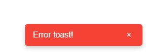

# Input,Toast,SidebarMenu

## Input

1. Text

   
   

2. Number

   
   

3. Password

   
   

## Toast

1. 

2. 

3. 

4. 

## Sidebar

1. Button

   
   

2. Menu about and favorites

   
   
   
